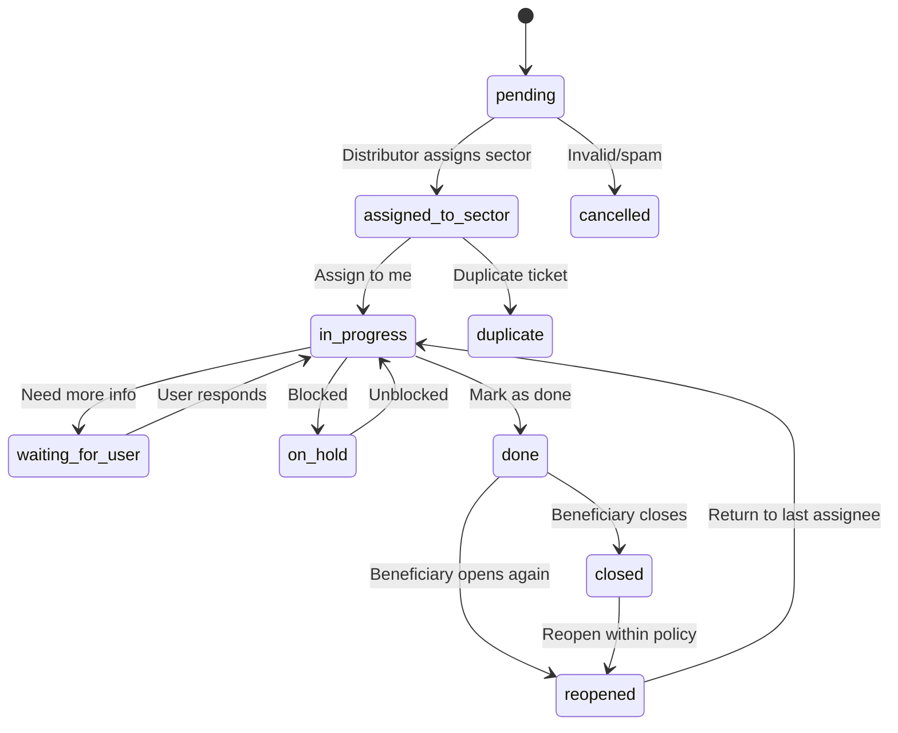

# Tickora — Business Requirements Document (BRD)

**Platformă de ticketing, tasking, distribuție operațională, audit, RBAC și dashboarding**  
**Versiune:** 1.0  
**Tehnologii țintă:** Python + Flask + framework intern `qf`, PostgreSQL, Keycloak SSO, React + Ant Design  
**Nume platformă:** Tickora

---

## 1. Executive Summary

**Tickora** este o platformă modernă de ticketing și tasking destinată gestionării solicitărilor provenite atât de la **beneficiari externi**, adică utilizatori externi care folosesc aplicația, cât și de la **beneficiari interni**, adică utilizatori din interiorul organizației care raportează probleme, cereri, incidente sau solicitări operaționale.

Platforma permite crearea unui ticket printr-un formular standardizat, distribuirea acestuia către un sector responsabil, preluarea ticketului de către un membru al sectorului, procesarea lui, comunicarea publică sau privată pe ticket, marcarea ca rezolvat și confirmarea finală de închidere de către beneficiar.

Tickora trebuie să fie protejată prin **Keycloak SSO**, să implementeze un sistem strict de **RBAC**, să auditeze toate acțiunile importante și să ofere dashboard-uri pentru monitorizarea performanței sistemului, sectoarelor și utilizatorilor.

Principii centrale:

1. **A vedea un ticket nu înseamnă automat a avea dreptul de a-l modifica.**
2. **Admin-ul poate vedea și administra tot în sistem.**
3. **Comentariile private nu trebuie expuse niciodată beneficiarilor.**
4. **Orice acțiune operațională importantă trebuie auditată.**
5. **Un sector are mai mulți membri și cel puțin un rol de coordonare: Șef Sector.**

---

## 2. Context și problemă de business

Organizațiile care primesc solicitări din mai multe surse au nevoie de un sistem unitar prin care acestea să fie:

- înregistrate controlat;
- atribuite sectorului corect;
- preluate de un responsabil clar;
- urmărite până la rezolvare;
- comunicate transparent către beneficiar;
- auditate complet;
- măsurate prin indicatori operaționali.

Fără o platformă dedicată, apar probleme precum:

- solicitări pierdute;
- responsabilitate neclară;
- distribuire informală;
- lipsă audit;
- lipsă SLA;
- lipsă vizibilitate managerială;
- imposibilitatea de a vedea cine a lucrat, cât a durat și unde s-a blocat procesul;
- imposibilitatea de a separa comunicarea publică față de comunicarea internă;
- lipsă trasabilitate pentru modificări sensibile;
- imposibilitatea de a diferenția clar beneficiarii interni de cei externi.

Tickora rezolvă aceste probleme printr-un sistem structurat de ticketing cu workflow, RBAC, audit, dashboard și raportare.

---

## 3. Obiectivele platformei

### 3.1 Obiectiv principal

Tickora trebuie să ofere o platformă centralizată pentru gestionarea solicitărilor provenite de la beneficiari interni și externi, printr-un flux clar de creare, distribuire, preluare, procesare, rezolvare, confirmare și închidere.

### 3.2 Obiective funcționale

Platforma trebuie să permită:

- autentificare SSO prin Keycloak;
- creare ticket de către beneficiar intern sau extern;
- completare formular cu date standardizate;
- atașare de fișiere;
- clasificare pe categorie, tip și prioritate;
- distribuire ticket către sector;
- vizualizare ticket de către membrii sectorului;
- preluare ticket prin `Assign to me`;
- modificare ticket doar de către utilizatorii autorizați;
- comentarii publice și private;
- notificări pe evenimente importante;
- workflow de status;
- închidere de către beneficiar;
- redeschidere de către beneficiar;
- revenirea ticketului redeschis la ultimul membru activ;
- dashboard global, pe sector și pe utilizator;
- audit complet;
- administrare utilizatori, sectoare, roluri aplicație, categorii, SLA-uri și nomenclatoare;
- export rapoarte;
- căutare și filtrare avansată.

### 3.3 Obiective tehnice

Platforma trebuie să fie:

- scalabilă;
- auditată;
- securizată;
- ușor de extins;
- bazată pe PostgreSQL cu structură relațională;
- integrabilă cu alte sisteme;
- pregătită pentru dashboard-uri și raportare;
- compatibilă cu deployment containerizat/Kubernetes;
- observabilă prin logs, metrics și tracing.

---

## 4. Domeniul de aplicare

### 4.1 In scope

În prima versiune completă a platformei intră:

- modul autentificare/autorizare;
- integrare Keycloak;
- modul beneficiari interni/externi;
- creare ticket;
- distribuire către sector;
- preluare de către membru sector;
- rol de Șef Sector;
- rol de Membru Sector;
- comentarii publice/private;
- atașamente;
- workflow ticket;
- audit;
- dashboard;
- raportare;
- administrare platformă;
- notificări;
- SLA;
- căutare și filtrare.

### 4.2 Out of scope pentru MVP, dar recomandat ulterior

- aplicație mobilă nativă;
- integrare AI pentru clasificare automată;
- integrare chatbot;
- integrare completă cu sisteme externe de asset management;
- integrare cu ERP/CRM;
- engine complex de business process management;
- data warehouse separat;
- machine learning pentru predicție SLA breach.

---

## 5. Concepte principale

### 5.1 Ticket

Un **ticket** reprezintă o solicitare introdusă în sistem de un beneficiar intern sau extern.

Exemplu:

```text
Ticket Code: TK-2026-000001
Beneficiar: Extern
Nume: Popescu Ion
IP afectat: 10.10.20.30
Sector sugerat: s4
Sector curent: s10
Status: in_progress
Assignee: Ionescu Andrei
Prioritate: high
Categorie: network_issue
```

### 5.2 Beneficiar

Beneficiarul este persoana sau entitatea pentru care se creează ticketul.

Tickora trebuie să suporte două tipuri de beneficiari:

1. **Beneficiar extern**
2. **Beneficiar intern**

Această distincție este importantă pentru:

- vizibilitate;
- notificări;
- date de contact;
- raportare;
- SLA;
- integrare cu sistemul de identitate;
- dreptul de a închide/redeschide ticketul.

### 5.3 Sector

Un sector este o unitate operațională responsabilă de procesarea ticketelor.

Exemple:

```text
s1
s2
s3
...
s10
```

Un sector are:

- cod;
- nume;
- descriere;
- stare activ/inactiv;
- unul sau mai mulți membri;
- unul sau mai mulți șefi de sector;
- reguli de SLA opționale;
- coadă proprie de lucru.

### 5.4 Șef Sector

Șeful de sector este responsabilul operațional pentru un sector.

Poate:

- vedea toate ticketele sectorului;
- asigna/reasigna tickete membrilor;
- interveni în blocaje;
- schimba prioritatea;
- vedea dashboard-ul sectorului;
- vedea performanța membrilor;
- gestiona escaladări;
- valida sau supraveghea rezolvările.

### 5.5 Membru Sector

Membrul de sector este utilizatorul operațional care preia și procesează tickete.

Poate:

- vedea ticketele sectorului;
- prelua tickete;
- comenta;
- modifica ticketele asignate lui;
- marca ticketul ca `done`.

### 5.6 Distributor

Distributorul este utilizatorul care face trierea inițială și arondează ticketul unui sector.

### 5.7 Admin

Admin-ul are vizibilitate și control administrativ complet.

Poate vedea:

- toate ticketele;
- toți beneficiarii;
- toate sectoarele;
- toți utilizatorii;
- toate comentariile publice/private;
- toate atașamentele, în funcție de politica de acces;
- tot auditul;
- toate dashboard-urile;
- toate configurările.

Poate administra:

- sectoare;
- roluri aplicație;
- mapări Keycloak;
- SLA-uri;
- priorități;
- categorii;
- nomenclatoare;
- reguli de notificare;
- permisiuni;
- setări generale;
- exporturi;
- retenție date.

---

## 6. Tipuri de beneficiari

### 6.1 Beneficiar extern

Un beneficiar extern este o persoană din afara organizației sau din afara structurii interne de operare care folosește aplicația pentru a crea și urmări tickete.

Exemple:

- client;
- cetățean;
- partener;
- utilizator al unei aplicații publice;
- organizație externă;
- furnizor;
- beneficiar instituțional extern.

#### Date specifice beneficiar extern

| Câmp | Obligatoriu | Observații |
|---|---:|---|
| tip beneficiar | da | `external` |
| nume | da | numele persoanei |
| prenume | da | prenumele persoanei |
| email | recomandat | pentru notificări |
| telefon | opțional | pentru contact rapid |
| organizație | opțional | firmă/instituție |
| identificator extern | opțional, sensibil | doar dacă există bază legală |
| IP afectat | opțional/da în funcție de caz | IP-ul raportat |
| IP request | automat | IP-ul de pe care s-a făcut requestul |
| canal creare | da | portal/web/api/email |
| consimțământ comunicare | opțional | dacă este necesar |

#### Vizibilitate beneficiar extern

Beneficiarul extern poate vedea:

- ticketele proprii;
- statusul ticketului;
- comentariile publice;
- atașamentele publice;
- rezoluția;
- istoricul public;
- butoanele `Close` și `Open again`, când sunt permise.

Beneficiarul extern nu poate vedea:

- comentarii private;
- audit intern;
- informații interne despre sector dacă politica nu permite;
- performanța operatorilor;
- dashboard-uri interne;
- ticketele altor beneficiari.

### 6.2 Beneficiar intern

Un beneficiar intern este un utilizator din interiorul organizației care creează un ticket pentru o problemă internă, operațională sau tehnică.

Exemple:

- angajat;
- operator;
- manager;
- membru al unui departament;
- membru al unui sector;
- utilizator intern al unei aplicații.

#### Date specifice beneficiar intern

Pentru beneficiarii interni, multe date pot veni din Keycloak:

| Câmp | Sursă | Observații |
|---|---|---|
| keycloak subject | token | identificator unic |
| username | token | user intern |
| email | token | email intern |
| nume | token/formular | poate fi precompletat |
| prenume | token/formular | poate fi precompletat |
| departament | Keycloak/custom | opțional |
| sector intern | Keycloak/custom | opțional |
| telefon intern | profil local | opțional |
| IP afectat | formular | stație/server/aplicație afectată |

#### Vizibilitate beneficiar intern

Beneficiarul intern poate vedea:

- ticketele create de el;
- comentariile publice de pe ticket;
- statusul;
- rezoluția;
- atașamente publice;
- acțiunile `Close` și `Open again`.

Dacă beneficiarul intern are și rol operațional, de exemplu `Membru Sector`, atunci poate avea vizibilitate suplimentară asupra ticketelor sectorului său, dar această vizibilitate este separată de calitatea lui de beneficiar.

Exemplu:

```text
Andrei este membru al sectorului s10.
Andrei creează un ticket ca beneficiar intern pentru problema lui.

Pe ticketul creat de el, Andrei este beneficiar.
Pe ticketele sectorului s10, Andrei este membru sector.

Sistemul trebuie să poată distinge contextul în care Andrei acționează.
```

### 6.3 Diferențe între beneficiar intern și extern

| Caracteristică | Beneficiar extern | Beneficiar intern |
|---|---:|---:|
| Identitate Keycloak | posibil, dar nu obligatoriu | da |
| Date precompletate din SSO | posibil | da |
| Apartenență la organizație | nu | da |
| Poate avea rol operațional | de regulă nu | da |
| Vizibilitate dashboard | nu | doar dacă are rol suplimentar |
| Comentarii private | nu | nu, în calitate de beneficiar |
| Poate crea ticket | da | da |
| Poate închide ticket propriu | da | da |
| Poate redeschide ticket propriu | da | da |
| Poate vedea ticketele altora | nu | doar dacă are rol intern suplimentar |

---

## 7. Actori și roluri

### 7.1 Beneficiar Extern

Permisiuni:

- creează ticket;
- vede ticketul propriu;
- adaugă comentarii publice pe ticketul propriu;
- vede comentariile publice;
- primește notificări;
- închide ticketul;
- redeschide ticketul.

Restricții:

- nu vede comentarii private;
- nu vede dashboard;
- nu vede audit intern;
- nu vede ticketele altor beneficiari;
- nu poate asigna;
- nu poate schimba sector;
- nu poate modifica statusul operațional, cu excepția `Close` / `Open again`.

### 7.2 Beneficiar Intern

Permisiuni de bază:

- creează ticket;
- vede ticketul propriu;
- comentează public;
- închide;
- redeschide;
- primește notificări.

Dacă are și alte roluri, permisiunile se cumulează, dar trebuie evaluate contextual.

### 7.3 Distributor

Permisiuni:

- vede tickete noi/nedistribuite;
- vede tickete aflate în coada de distribuire;
- arondează către sector;
- redistribuie către alt sector, dacă politica permite;
- adaugă comentarii private;
- schimbă categoria/prioritatea inițială;
- vede auditul operațional al ticketelor pe care le distribuie;
- vede dashboard de distribuire.

### 7.4 Membru Sector

Permisiuni:

- vede ticketele sectorului său;
- poate prelua ticket prin `Assign to me`;
- poate modifica doar ticketele asignate lui;
- poate adăuga comentarii publice/private pe ticketele la care are acces;
- poate marca ticketul ca `done`;
- poate solicita informații suplimentare;
- poate vedea istoricul ticketului;
- poate vedea propriile statistici.

Restricții:

- nu poate modifica tickete asignate altui membru;
- nu poate schimba sectorul fără permisiune;
- nu poate gestiona membrii sectorului;
- nu poate vedea ticketele altor sectoare;
- nu poate vedea tot sistemul.

### 7.5 Șef Sector

Permisiuni:

- vede toate ticketele sectorului;
- vede toate comentariile private/publice din sector;
- poate asigna un ticket unui membru;
- poate reasigna între membri;
- poate schimba prioritatea;
- poate marca ticket ca blocat/on hold;
- poate interveni pe ticket dacă assignee-ul este indisponibil;
- poate vedea dashboard-ul sectorului;
- poate vedea statistici per membru;
- poate gestiona escaladări;
- poate exporta rapoarte pentru sector.

Restricții:

- nu vede în mod implicit ticketele altor sectoare;
- nu administrează global sistemul;
- nu modifică configurații globale, decât dacă are rol suplimentar.

### 7.6 Admin

Admin-ul are vizibilitate totală și control administrativ complet.

Permisiuni:

- vede toate ticketele din sistem;
- vede toate comentariile publice/private;
- vede toate atașamentele, conform politicii de securitate;
- vede toți utilizatorii;
- vede toți beneficiarii interni/externi;
- vede toate sectoarele;
- vede toate dashboard-urile;
- vede tot auditul;
- gestionează sectoare;
- gestionează mapări Keycloak;
- gestionează nomenclatoare;
- gestionează SLA-uri;
- gestionează reguli de notificare;
- gestionează categorii;
- gestionează priorități;
- poate face reassign global;
- poate schimba sectorul oricărui ticket;
- poate închide/redeschide administrativ;
- poate anula ticket;
- poate exporta date;
- poate configura retenție și politici de sistem.

Principiu:

```text
Admin-ul poate vedea și administra tot în Tickora.
```

Totuși, chiar și acțiunile Admin-ului trebuie auditate.

### 7.7 Auditor

Rol read-only pentru verificări, conformitate și investigații.

Permisiuni:

- vede tickete;
- vede audit;
- vede istoric;
- vede comentarii private, dacă politica permite;
- exportă rapoarte de audit;
- nu modifică date operaționale.

### 7.8 System / Service Account

Cont tehnic pentru automatizări.

Exemple:

- notificări;
- auto-close;
- SLA checks;
- import tickete din API;
- webhook integrations;
- agregări dashboard.

Acțiunile conturilor tehnice trebuie auditate cu actor clar:

```text
system:sla-checker
system:auto-close-worker
system:notification-worker
```

---

## 8. Structura organizațională: sectoare, șefi și membri

### 8.1 Sector

Un sector este o unitate operațională.

Exemplu:

```text
Sector:
  code: s10
  name: Rețea și infrastructură
  active: true
```

### 8.2 Membri sector

Un sector poate avea mai mulți membri.

Exemplu:

```text
s10:
  - Popescu Andrei — Membru Sector
  - Ionescu Maria — Membru Sector
  - Georgescu Vlad — Membru Sector
```

### 8.3 Șef sector

Un sector poate avea unul sau mai mulți șefi de sector.

Exemplu:

```text
s10:
  - Dumitrescu Elena — Șef Sector
```

Se recomandă suport pentru mai mulți șefi de sector pentru:

- concedii;
- backup;
- ture;
- responsabilități partajate.

### 8.4 Apartenență multiplă

Un utilizator poate aparține mai multor sectoare.

Exemplu:

```text
User: Andrei
Sectoare:
  - s4 ca Membru Sector
  - s10 ca Membru Sector
```

Sau:

```text
User: Elena
Sectoare:
  - s10 ca Șef Sector
  - s9 ca Membru Sector
```

Sistemul trebuie să evalueze permisiunile în funcție de sectorul ticketului.

---

## 9. RBAC și matrice de permisiuni

### 9.1 Roluri recomandate în Keycloak

Roluri globale:

```text
tickora_admin
tickora_auditor
tickora_distributor
tickora_internal_user
tickora_external_user
```

Roluri operaționale:

```text
tickora_sector_member
tickora_sector_chief
```

Roluri tehnice:

```text
tickora_service_account
```

### 9.2 Grupuri Keycloak recomandate

Pentru sectoare:

```text
/tickora/sectors/s1/members
/tickora/sectors/s1/chiefs

/tickora/sectors/s2/members
/tickora/sectors/s2/chiefs

...

/tickora/sectors/s10/members
/tickora/sectors/s10/chiefs
```

### 9.3 Model de autorizare recomandat

Autorizarea trebuie să combine:

1. roluri globale;
2. apartenență la sector;
3. relația cu ticketul;
4. statusul ticketului;
5. assignee-ul curent;
6. tipul beneficiarului;
7. vizibilitatea comentariului;
8. contextul acțiunii.

Exemplu:

```text
Un utilizator cu rol Membru Sector s10 poate vedea ticketul dacă ticket.current_sector = s10.
Poate modifica ticketul doar dacă ticket.assignee_user_id = user.id.
```

### 9.4 Matrice de permisiuni

| Acțiune | Beneficiar extern | Beneficiar intern | Distributor | Membru Sector | Șef Sector | Admin | Auditor |
|---|---:|---:|---:|---:|---:|---:|---:|
| Creează ticket | da | da | da | da | da | da | nu |
| Vede ticket propriu | da | da | da | da | da | da | da |
| Vede tickete nedistribuite | nu | nu | da | nu | opțional | da | da |
| Arondează către sector | nu | nu | da | nu | da | da | nu |
| Schimbă sector | nu | nu | da/opțional | nu | opțional | da | nu |
| Vede tickete sector propriu | nu | dacă are rol sector | opțional | da | da | da | da |
| Vede toate ticketele | nu | nu | nu/opțional | nu | nu/opțional | da | da |
| Assign to me | nu | dacă are rol sector | nu/opțional | da | da | da | nu |
| Assign către alt membru | nu | nu | nu/opțional | nu | da | da | nu |
| Reassign | nu | nu | nu/opțional | nu | da | da | nu |
| Modifică ticket asignat sieși | nu | dacă este assignee | dacă are rol sector | da | da | da | nu |
| Modifică ticket asignat altcuiva | nu | nu | nu | nu | da | da | nu |
| Adaugă comentariu public | da pe propriu | da pe propriu | da | da | da | da | nu |
| Adaugă comentariu privat | nu | doar dacă rol intern operațional | da | da | da | da | nu |
| Vede comentarii private | nu | doar dacă rol intern operațional și acces | da | da | da | da | da |
| Mark as done | nu | dacă este assignee | nu/opțional | da, dacă assignee | da | da | nu |
| Close | da pe propriu | da pe propriu | opțional | nu | da | da | nu |
| Open again | da pe propriu | da pe propriu | opțional | nu | da | da | nu |
| Anulare ticket | nu | nu/opțional | opțional | nu | da | da | nu |
| Export rapoarte | nu | nu | limitat | limitat | da pe sector | da | da |
| Dashboard global | nu | nu | limitat | nu | nu/opțional | da | da |
| Dashboard sector | nu | nu | opțional | limitat | da | da | da |
| Administrare sectoare | nu | nu | nu | nu | nu | da | nu |
| Administrare utilizatori | nu | nu | nu | nu | nu | da | nu |
| Vizualizare audit global | nu | nu | nu/opțional | nu | sector/opțional | da | da |

---

## 10. Fluxuri operaționale principale

### 10.1 Creare ticket de către beneficiar extern

#### Pași

1. Beneficiarul extern accesează formularul de creare ticket.
2. Completează datele de identificare.
3. Completează IP-ul, sectorul sugerat și descrierea.
4. Atașează fișiere, dacă este cazul.
5. Trimite formularul.
6. Sistemul validează datele.
7. Sistemul creează ticket cu status `pending`.
8. Sistemul generează cod unic.
9. Sistemul notifică distributorii.
10. Sistemul scrie audit event.

#### Payload exemplu

```json
{
  "beneficiary_type": "external",
  "requester_first_name": "Ion",
  "requester_last_name": "Popescu",
  "requester_email": "ion.popescu@example.com",
  "requester_phone": "0712345678",
  "organization_name": "Client Extern SRL",
  "requester_ip": "10.20.30.40",
  "suggested_sector_code": "s3",
  "category": "access_issue",
  "priority": "medium",
  "txt": "Nu pot accesa aplicația. Primesc eroare 403."
}
```

### 10.2 Creare ticket de către beneficiar intern

#### Pași

1. Utilizatorul intern este autentificat prin Keycloak.
2. Formularul este precompletat cu nume, prenume, email.
3. Utilizatorul completează descrierea și datele problemei.
4. Sistemul creează ticketul.
5. Beneficiarul intern devine `created_by_user_id`.
6. Ticketul intră în coada de distribuire.

#### Payload exemplu

```json
{
  "beneficiary_type": "internal",
  "requester_ip": "10.10.50.25",
  "category": "network_issue",
  "priority": "high",
  "txt": "Stația mea nu poate accesa aplicația internă de raportare."
}
```

### 10.3 Distribuire ticket către sector

#### Pași

1. Distributorul accesează coada de tickete `pending`.
2. Selectează ticketul.
3. Analizează datele introduse.
4. Selectează sectorul responsabil.
5. Introduce motiv, dacă este necesar.
6. Confirmă distribuirea.
7. Ticketul este mutat în coada sectorului.
8. Membrii sectorului și șeful de sector pot vedea ticketul.
9. Sistemul scrie audit.

#### Reguli

- Doar distributorul, șeful de sector cu drepturi extinse sau admin-ul pot distribui.
- Sectorul trebuie să fie activ.
- Distribuirea trebuie să seteze `current_sector_id`.
- Se păstrează `suggested_sector_id` separat de `current_sector_id`.
- Se actualizează `sector_assigned_at`.

### 10.4 Vizualizare de către membrii sectorului

Membrii sectorului văd ticketele arondate sectorului lor.

Regulă:

```text
Membru Sector poate vedea ticket dacă ticket.current_sector_id este în lista sectoarelor lui.
```

Dar:

```text
Membru Sector poate modifica ticket doar dacă este assignee curent.
```

### 10.5 Assign to me

#### Pași

1. Membrul sectorului deschide ticketul.
2. Apasă `Assign to me`.
3. Backend-ul verifică permisiunile.
4. Backend-ul face update atomic.
5. Ticketul trece în `in_progress`.
6. Utilizatorul devine assignee.
7. Se scrie audit.

#### Reguli de concurență

Doi membri pot încerca simultan să preia același ticket.

Sistemul trebuie să prevină dubla asignare prin update atomic.

Exemplu SQL conceptual:

```sql
UPDATE tickets
SET assignee_user_id = :current_user_id,
    last_active_assignee_user_id = :current_user_id,
    status = 'in_progress',
    assigned_at = now(),
    updated_at = now()
WHERE id = :ticket_id
  AND current_sector_id = :user_sector_id
  AND assignee_user_id IS NULL
  AND status IN ('pending', 'assigned_to_sector', 'reopened')
RETURNING *;
```

Dacă nu se returnează niciun rând, ticketul nu mai poate fi preluat.

### 10.6 Procesare ticket

Assignee-ul poate:

- adăuga comentarii;
- actualiza prioritatea;
- cere informații suplimentare;
- atașa documente;
- modifica rezoluția;
- marca ticketul ca `done`.

### 10.7 Comentarii publice/private

#### Comentariu public

Vizibil pentru:

- beneficiar;
- membrii autorizați;
- șef sector;
- distributor;
- admin;
- auditor.

#### Comentariu privat

Vizibil pentru:

- distributor;
- membru sector autorizat;
- șef sector;
- admin;
- auditor, dacă politica permite.

Nu este vizibil pentru:

- beneficiar extern;
- beneficiar intern în calitate strictă de beneficiar.

### 10.8 Mark as done

Assignee-ul marchează ticketul ca rezolvat operațional.

Condiții:

- ticketul are assignee;
- ticketul este în `in_progress`, `reopened`, `waiting_for_user` sau `on_hold`;
- rezoluția este completată;
- se scrie audit;
- beneficiarul este notificat.

### 10.9 Close de către beneficiar

Beneficiarul poate închide ticketul dacă este de acord cu rezolvarea.

Condiții:

- ticketul este `done`;
- utilizatorul este beneficiarul/creatorul;
- se completează feedback opțional;
- se setează `closed_at`;
- se scrie audit.

### 10.10 Open again de către beneficiar

Beneficiarul poate redeschide ticketul dacă rezolvarea nu este satisfăcătoare.

Condiții:

- ticketul este `done` sau `closed`;
- utilizatorul este beneficiarul;
- redeschiderea este în intervalul permis;
- beneficiarul introduce motiv;
- ticketul revine la `last_active_assignee_user_id`;
- se incrementează `reopened_count`;
- se scrie audit.

---

## 11. Mașina de stări a ticketului

### 11.1 Stări minime cerute

```text
pending
in_progress
done
closed
reopened
```

### 11.2 Stări recomandate pentru producție

```text
pending
assigned_to_sector
in_progress
waiting_for_user
on_hold
done
closed
reopened
cancelled
duplicate
```

### 11.3 Tranziții recomandate



### 11.4 Descriere stări

| Status | Descriere | Cine îl setează |
|---|---|---|
| `pending` | Ticket creat, așteaptă distribuire | sistem |
| `assigned_to_sector` | Ticket arondat sectorului, nepreluat | distributor/admin |
| `in_progress` | Ticket preluat de un operator | membru sector |
| `waiting_for_user` | Se așteaptă informații de la beneficiar | assignee |
| `on_hold` | Ticket blocat de o dependență | assignee/șef sector |
| `done` | Rezolvat operațional | assignee |
| `closed` | Închis final de beneficiar/admin | beneficiar/admin |
| `reopened` | Redeschis după done/closed | beneficiar/admin |
| `cancelled` | Anulat | distributor/șef/admin |
| `duplicate` | Marcat duplicat | distributor/șef/admin |

---

## 12. Funcționalități principale

### 12.1 Modul creare ticket

Cerințe:

- formular diferențiat pentru beneficiar intern/extern;
- câmpuri obligatorii configurabile;
- validare IP;
- validare email/telefon;
- validare lungime descriere;
- upload atașamente;
- captură automată `source_ip`, `user_agent`, `correlation_id`;
- generare `ticket_code`;
- audit `TICKET_CREATED`.

### 12.2 Modul listare tickete

Liste recomandate:

#### Beneficiar

- My Tickets
- Active Tickets
- Closed Tickets

#### Distributor

- Distribution Queue
- Recently Distributed
- Reassignment Candidates
- Invalid/Duplicate Review

#### Membru Sector

- Sector Queue
- Assigned to Me
- Waiting for User
- Done by Me
- Reopened to Me

#### Șef Sector

- Sector Overview
- Unassigned in Sector
- Assigned Tickets
- Blocked Tickets
- SLA Breaches
- Team Workload

#### Admin

- All Tickets
- All Active Tickets
- All Closed Tickets
- All Reopened Tickets
- All SLA Breaches
- Audit Explorer
- System Overview

### 12.3 Filtre recomandate

- status;
- sector;
- assignee;
- șef sector;
- beneficiar intern/extern;
- creator;
- prioritate;
- categorie;
- tip;
- interval created_at;
- interval updated_at;
- interval done_at;
- interval closed_at;
- SLA status;
- text search;
- IP;
- ticket code;
- has attachments;
- reopened only;
- overdue only;
- source channel.

### 12.4 Pagina detalii ticket

Trebuie să includă:

- cod ticket;
- status;
- prioritate;
- categorie;
- tip beneficiar;
- date beneficiar;
- sector curent;
- assignee curent;
- șef sector;
- descriere;
- IP afectat;
- IP request;
- date creare/update;
- SLA;
- timeline;
- comentarii;
- atașamente;
- audit sumar;
- acțiuni disponibile contextual.

### 12.5 Modul comentarii

Cerințe:

- comentarii publice;
- comentarii private;
- comentarii sistem;
- atașamente pe comentarii;
- mențiuni;
- editare limitată în timp, dacă se dorește;
- delete logic doar cu audit;
- filtrare server-side în funcție de vizibilitate.

### 12.6 Modul atașamente

Cerințe:

- upload pe ticket;
- upload pe comentariu;
- vizibilitate public/private;
- metadata în PostgreSQL;
- fișier în object storage, recomandat MinIO/S3;
- scanare antivirus, dacă se integrează;
- limită dimensiune;
- extensii permise;
- audit la upload/download/delete.

### 12.7 Modul notificări

Canale:

- in-app;
- email;
- WebSocket/SSE;
- webhook intern;
- opțional Teams/Slack.

Evenimente:

- ticket creat;
- ticket distribuit;
- ticket preluat;
- comentariu public;
- comentariu privat cu mențiune;
- ticket done;
- ticket closed;
- ticket reopened;
- SLA approaching breach;
- SLA breached;
- reassign.

### 12.8 Modul SLA

SLA-uri recomandate:

- timp până la distribuire;
- timp până la preluare;
- timp până la primul răspuns;
- timp până la rezolvare;
- timp până la închidere;
- timp petrecut în fiecare status.

Exemplu:

| Prioritate | First response | Resolution target |
|---|---:|---:|
| Critical | 15 minute | 4 ore |
| High | 1 oră | 8 ore |
| Medium | 4 ore | 2 zile |
| Low | 1 zi | 5 zile |

### 12.9 Modul administrare

Admin-ul trebuie să poată administra:

- utilizatori;
- beneficiari;
- sectoare;
- membri sector;
- șefi sector;
- roluri;
- categorii;
- priorități;
- tipuri ticket;
- SLA policies;
- reguli notificare;
- template-uri comentarii;
- statusuri permise;
- motive de anulare/redeschidere;
- retenție date;
- setări generale.

---

## 13. Funcționalități moderne recomandate

### 13.1 Full-text search

Căutare în:

- cod ticket;
- descriere;
- comentarii publice/private, în funcție de rol;
- IP;
- nume/prenume beneficiar;
- organizație;
- rezoluție;
- categorie.

Implementare PostgreSQL:

```sql
CREATE INDEX idx_tickets_search_vector
ON tickets
USING gin(search_vector);
```

### 13.2 Timeline unificat

Timeline-ul trebuie să combine:

- comentarii;
- schimbări de status;
- schimbări de sector;
- assign/reassign;
- schimbări de prioritate;
- atașamente;
- SLA events;
- system notes.

### 13.3 Duplicate detection

Sistemul poate detecta tickete similare pe baza:

- aceluiași IP;
- aceluiași beneficiar;
- text similar;
- aceeași categorie;
- interval scurt de timp.

### 13.4 Auto-suggest sector

Reguli posibile:

```text
Dacă IP începe cu 10.10.x.x => sugerează sector s3
Dacă categoria este network_issue => sugerează sector s10
Dacă textul conține VPN => sugerează sector s7
```

La început recomandare:

```text
Sistemul sugerează, distributorul confirmă.
```

### 13.5 Parent/child tickets

Pentru solicitări complexe:

```text
Ticket părinte: Aplicația nu funcționează
Child 1: Verificare rețea - s10
Child 2: Verificare aplicație - s4
Child 3: Verificare DB - s2
```

### 13.6 Watchers/followers

Utilizatori interni pot urmări un ticket fără să fie assignee.

### 13.7 Mentions

Comentarii private cu mențiuni:

```text
@andrei verifică firewall-ul pentru IP-ul 10.20.30.40.
```

### 13.8 Templates

Răspunsuri predefinite:

```text
Te rugăm să trimiți un screenshot cu eroarea.
Solicitarea a fost escaladată către sectorul responsabil.
Problema a fost rezolvată. Te rugăm să confirmi.
```

### 13.9 Feedback beneficiar

După `Close`, beneficiarul poate da feedback:

- rating 1-5;
- comentariu;
- motiv nemulțumire;
- timp perceput;
- calitatea comunicării.

### 13.10 Escaladare automată

Exemple:

```text
pending > 2h => notifică distributor lead/admin
assigned_to_sector > 4h fără assign => notifică șef sector
critical fără assign > 15min => notifică admin
in_progress peste SLA => escaladare șef sector
```

---

## 14. Dashboard și raportare

### 14.1 Dashboard global Admin

Admin-ul vede:

- total tickete;
- tickete active;
- tickete noi astăzi;
- tickete închise astăzi;
- tickete pe status;
- tickete pe sector;
- tickete pe beneficiar intern/extern;
- tickete pe prioritate;
- tickete pe categorie;
- SLA breached;
- timp mediu de distribuire;
- timp mediu de preluare;
- timp mediu de rezolvare;
- top sectoare cu backlog;
- top utilizatori după volum;
- rata de redeschidere;
- trenduri zilnice/săptămânale/lunare.

### 14.2 Dashboard sector

Șeful de sector vede:

- tickete active în sector;
- tickete nepreluate;
- tickete asignate pe membru;
- tickete rezolvate pe membru;
- timp mediu de prelucrare;
- SLA breached;
- reopened tickets;
- distribuție pe prioritate;
- distribuție pe categorie;
- workload per membru;
- ticket aging.

### 14.3 Dashboard membru sector

Membrul vede:

- tickete asignate lui;
- tickete rezolvate;
- tickete redeschise;
- timp mediu de rezolvare;
- SLA-uri apropiate de breach;
- backlog personal;
- comentarii care necesită răspuns.

### 14.4 Dashboard beneficiar

Beneficiarul vede:

- ticketele sale active;
- ticketele închise;
- status curent;
- ultimele comentarii publice;
- tickete care așteaptă confirmare;
- tickete care necesită răspuns.

### 14.5 KPI-uri recomandate

| KPI | Descriere |
|---|---|
| Tickets created/day | Număr tickete create pe zi |
| Tickets closed/day | Număr tickete închise pe zi |
| Current backlog | Tickete active |
| Average assignment time | Timp mediu până la assign |
| Average resolution time | Timp mediu până la done |
| Median resolution time | Mediană rezolvare |
| P95 resolution time | Percentila 95 pentru rezolvare |
| Reopen rate | Rata de redeschidere |
| SLA breach rate | Rata de încălcare SLA |
| First response time | Timp până la primul răspuns |
| Sector workload | Încărcare pe sector |
| Member workload | Încărcare pe membru |
| External vs internal tickets | Distribuție beneficiari |

---

## 15. Audit, trasabilitate și conformitate

### 15.1 Ce trebuie auditat

- creare ticket;
- modificare câmpuri ticket;
- distribuire sector;
- redistribuire sector;
- assign;
- reassign;
- schimbare status;
- schimbare prioritate;
- schimbare categorie;
- adăugare comentariu;
- editare comentariu;
- ștergere logică comentariu;
- upload atașament;
- download atașament, dacă este necesar;
- delete atașament;
- close;
- open again;
- anulare;
- marcare duplicat;
- export date;
- acces refuzat;
- modificări de configurare;
- modificări de roluri;
- modificări de sector.

### 15.2 Format audit recomandat

```json
{
  "action": "TICKET_STATUS_CHANGED",
  "entity_type": "ticket",
  "entity_id": "uuid",
  "ticket_id": "uuid",
  "actor_user_id": "uuid",
  "old_value": {
    "status": "in_progress"
  },
  "new_value": {
    "status": "done"
  },
  "metadata": {
    "reason": "Problem resolved",
    "source": "web-ui"
  },
  "request_ip": "10.0.0.1",
  "user_agent": "Mozilla/5.0...",
  "correlation_id": "uuid",
  "created_at": "2026-05-08T15:00:00+03:00"
}
```

### 15.3 Cerințe audit

- audit imutabil;
- fără hard delete;
- indexare după ticket, actor, acțiune, dată;
- export audit;
- partiționare lunară pentru volum mare;
- retenție configurabilă;
- audit inclusiv pentru admin.

---

## 16. Model de date PostgreSQL

### 16.1 users

```sql
CREATE TABLE users (
    id UUID PRIMARY KEY,
    keycloak_subject VARCHAR(255) UNIQUE,
    username VARCHAR(255),
    email VARCHAR(255),
    first_name VARCHAR(255),
    last_name VARCHAR(255),
    user_type VARCHAR(50) NOT NULL DEFAULT 'internal',
    is_active BOOLEAN NOT NULL DEFAULT true,
    created_at TIMESTAMPTZ NOT NULL DEFAULT now(),
    updated_at TIMESTAMPTZ NOT NULL DEFAULT now()
);
```

### 16.2 beneficiaries

```sql
CREATE TABLE beneficiaries (
    id UUID PRIMARY KEY,
    beneficiary_type VARCHAR(50) NOT NULL, -- internal/external

    user_id UUID REFERENCES users(id),

    first_name VARCHAR(255),
    last_name VARCHAR(255),
    email VARCHAR(255),
    phone VARCHAR(50),
    organization_name VARCHAR(255),
    external_identifier VARCHAR(255),

    created_at TIMESTAMPTZ NOT NULL DEFAULT now(),
    updated_at TIMESTAMPTZ NOT NULL DEFAULT now()
);
```

### 16.3 sectors

```sql
CREATE TABLE sectors (
    id UUID PRIMARY KEY,
    code VARCHAR(50) UNIQUE NOT NULL,
    name VARCHAR(255) NOT NULL,
    description TEXT,
    is_active BOOLEAN NOT NULL DEFAULT true,
    created_at TIMESTAMPTZ NOT NULL DEFAULT now(),
    updated_at TIMESTAMPTZ NOT NULL DEFAULT now()
);
```

### 16.4 sector_memberships

```sql
CREATE TABLE sector_memberships (
    id UUID PRIMARY KEY,
    user_id UUID NOT NULL REFERENCES users(id),
    sector_id UUID NOT NULL REFERENCES sectors(id),
    membership_role VARCHAR(50) NOT NULL, -- member/chief
    is_active BOOLEAN NOT NULL DEFAULT true,
    created_at TIMESTAMPTZ NOT NULL DEFAULT now(),
    updated_at TIMESTAMPTZ NOT NULL DEFAULT now(),

    CONSTRAINT uq_sector_membership UNIQUE(user_id, sector_id, membership_role)
);
```

### 16.5 tickets

```sql
CREATE TABLE tickets (
    id UUID PRIMARY KEY,
    ticket_code VARCHAR(50) UNIQUE NOT NULL,

    beneficiary_id UUID REFERENCES beneficiaries(id),
    beneficiary_type VARCHAR(50) NOT NULL, -- internal/external

    created_by_user_id UUID REFERENCES users(id),

    requester_first_name VARCHAR(255),
    requester_last_name VARCHAR(255),
    requester_email VARCHAR(255),
    requester_phone VARCHAR(50),
    requester_organization VARCHAR(255),

    requester_ip INET,
    source_ip INET,

    suggested_sector_id UUID REFERENCES sectors(id),
    current_sector_id UUID REFERENCES sectors(id),

    assignee_user_id UUID REFERENCES users(id),
    last_active_assignee_user_id UUID REFERENCES users(id),

    title VARCHAR(500),
    txt TEXT NOT NULL,
    resolution TEXT,

    category VARCHAR(100),
    type VARCHAR(100),
    priority VARCHAR(50) NOT NULL DEFAULT 'medium',
    status VARCHAR(50) NOT NULL DEFAULT 'pending',

    assigned_at TIMESTAMPTZ,
    sector_assigned_at TIMESTAMPTZ,
    first_response_at TIMESTAMPTZ,
    done_at TIMESTAMPTZ,
    closed_at TIMESTAMPTZ,
    reopened_at TIMESTAMPTZ,

    reopened_count INTEGER NOT NULL DEFAULT 0,

    sla_due_at TIMESTAMPTZ,
    sla_status VARCHAR(50) DEFAULT 'within_sla',

    is_deleted BOOLEAN NOT NULL DEFAULT false,

    created_at TIMESTAMPTZ NOT NULL DEFAULT now(),
    updated_at TIMESTAMPTZ NOT NULL DEFAULT now()
);
```

### 16.6 ticket_comments

```sql
CREATE TABLE ticket_comments (
    id UUID PRIMARY KEY,
    ticket_id UUID NOT NULL REFERENCES tickets(id),
    author_user_id UUID REFERENCES users(id),

    visibility VARCHAR(20) NOT NULL, -- public/private
    comment_type VARCHAR(50) NOT NULL DEFAULT 'user_comment',
    body TEXT NOT NULL,

    is_deleted BOOLEAN NOT NULL DEFAULT false,
    deleted_by_user_id UUID REFERENCES users(id),
    deleted_at TIMESTAMPTZ,

    created_at TIMESTAMPTZ NOT NULL DEFAULT now(),
    updated_at TIMESTAMPTZ NOT NULL DEFAULT now()
);
```

### 16.7 ticket_attachments

```sql
CREATE TABLE ticket_attachments (
    id UUID PRIMARY KEY,
    ticket_id UUID NOT NULL REFERENCES tickets(id),
    comment_id UUID REFERENCES ticket_comments(id),

    uploaded_by_user_id UUID REFERENCES users(id),

    file_name VARCHAR(500) NOT NULL,
    content_type VARCHAR(255),
    size_bytes BIGINT NOT NULL,

    storage_bucket VARCHAR(255) NOT NULL,
    storage_key TEXT NOT NULL,

    visibility VARCHAR(20) NOT NULL DEFAULT 'private',
    checksum_sha256 VARCHAR(128),

    is_deleted BOOLEAN NOT NULL DEFAULT false,
    deleted_by_user_id UUID REFERENCES users(id),
    deleted_at TIMESTAMPTZ,

    created_at TIMESTAMPTZ NOT NULL DEFAULT now()
);
```

### 16.8 ticket_status_history

```sql
CREATE TABLE ticket_status_history (
    id UUID PRIMARY KEY,
    ticket_id UUID NOT NULL REFERENCES tickets(id),
    old_status VARCHAR(50),
    new_status VARCHAR(50) NOT NULL,
    changed_by_user_id UUID REFERENCES users(id),
    reason TEXT,
    created_at TIMESTAMPTZ NOT NULL DEFAULT now()
);
```

### 16.9 ticket_sector_history

```sql
CREATE TABLE ticket_sector_history (
    id UUID PRIMARY KEY,
    ticket_id UUID NOT NULL REFERENCES tickets(id),
    old_sector_id UUID REFERENCES sectors(id),
    new_sector_id UUID REFERENCES sectors(id),
    changed_by_user_id UUID REFERENCES users(id),
    reason TEXT,
    created_at TIMESTAMPTZ NOT NULL DEFAULT now()
);
```

### 16.10 ticket_assignment_history

```sql
CREATE TABLE ticket_assignment_history (
    id UUID PRIMARY KEY,
    ticket_id UUID NOT NULL REFERENCES tickets(id),
    old_assignee_user_id UUID REFERENCES users(id),
    new_assignee_user_id UUID REFERENCES users(id),
    changed_by_user_id UUID REFERENCES users(id),
    reason TEXT,
    created_at TIMESTAMPTZ NOT NULL DEFAULT now()
);
```

### 16.11 audit_events

```sql
CREATE TABLE audit_events (
    id UUID PRIMARY KEY,

    actor_user_id UUID REFERENCES users(id),
    actor_keycloak_subject VARCHAR(255),
    actor_username VARCHAR(255),

    action VARCHAR(100) NOT NULL,
    entity_type VARCHAR(100) NOT NULL,
    entity_id UUID,

    ticket_id UUID REFERENCES tickets(id),

    old_value JSONB,
    new_value JSONB,
    metadata JSONB,

    request_ip INET,
    user_agent TEXT,
    correlation_id UUID,

    created_at TIMESTAMPTZ NOT NULL DEFAULT now()
);
```

### 16.12 notifications

```sql
CREATE TABLE notifications (
    id UUID PRIMARY KEY,
    user_id UUID NOT NULL REFERENCES users(id),
    ticket_id UUID REFERENCES tickets(id),

    type VARCHAR(100) NOT NULL,
    title VARCHAR(255) NOT NULL,
    body TEXT,

    is_read BOOLEAN NOT NULL DEFAULT false,
    read_at TIMESTAMPTZ,

    created_at TIMESTAMPTZ NOT NULL DEFAULT now()
);
```

### 16.13 sla_policies

```sql
CREATE TABLE sla_policies (
    id UUID PRIMARY KEY,
    name VARCHAR(255) NOT NULL,
    priority VARCHAR(50) NOT NULL,
    category VARCHAR(100),
    beneficiary_type VARCHAR(50),
    first_response_minutes INTEGER NOT NULL,
    resolution_minutes INTEGER NOT NULL,
    is_active BOOLEAN NOT NULL DEFAULT true,
    created_at TIMESTAMPTZ NOT NULL DEFAULT now(),
    updated_at TIMESTAMPTZ NOT NULL DEFAULT now()
);
```

### 16.14 ticket_links

```sql
CREATE TABLE ticket_links (
    id UUID PRIMARY KEY,
    source_ticket_id UUID NOT NULL REFERENCES tickets(id),
    target_ticket_id UUID NOT NULL REFERENCES tickets(id),
    link_type VARCHAR(50) NOT NULL,
    created_by_user_id UUID REFERENCES users(id),
    created_at TIMESTAMPTZ NOT NULL DEFAULT now(),

    CONSTRAINT uq_ticket_link UNIQUE(source_ticket_id, target_ticket_id, link_type)
);
```

---

## 17. Indexare PostgreSQL recomandată

### 17.1 Indexuri users

```sql
CREATE UNIQUE INDEX idx_users_keycloak_subject ON users(keycloak_subject);
CREATE INDEX idx_users_email ON users(email);
CREATE INDEX idx_users_username ON users(username);
```

### 17.2 Indexuri beneficiaries

```sql
CREATE INDEX idx_beneficiaries_type ON beneficiaries(beneficiary_type);
CREATE INDEX idx_beneficiaries_email ON beneficiaries(email);
CREATE INDEX idx_beneficiaries_user_id ON beneficiaries(user_id);
CREATE INDEX idx_beneficiaries_org ON beneficiaries(organization_name);
```

### 17.3 Indexuri sector_memberships

```sql
CREATE INDEX idx_sector_memberships_user ON sector_memberships(user_id);
CREATE INDEX idx_sector_memberships_sector ON sector_memberships(sector_id);
CREATE INDEX idx_sector_memberships_role ON sector_memberships(sector_id, membership_role);
```

### 17.4 Indexuri tickets

```sql
CREATE INDEX idx_tickets_status ON tickets(status);
CREATE INDEX idx_tickets_priority ON tickets(priority);
CREATE INDEX idx_tickets_category ON tickets(category);
CREATE INDEX idx_tickets_type ON tickets(type);
CREATE INDEX idx_tickets_beneficiary_type ON tickets(beneficiary_type);

CREATE INDEX idx_tickets_current_sector_status
ON tickets(current_sector_id, status);

CREATE INDEX idx_tickets_assignee_status
ON tickets(assignee_user_id, status);

CREATE INDEX idx_tickets_created_by_user
ON tickets(created_by_user_id);

CREATE INDEX idx_tickets_beneficiary
ON tickets(beneficiary_id);

CREATE INDEX idx_tickets_created_at
ON tickets(created_at DESC);

CREATE INDEX idx_tickets_updated_at
ON tickets(updated_at DESC);

CREATE INDEX idx_tickets_done_at
ON tickets(done_at DESC);

CREATE INDEX idx_tickets_closed_at
ON tickets(closed_at DESC);

CREATE INDEX idx_tickets_sla_due_at
ON tickets(sla_due_at);

CREATE INDEX idx_tickets_requester_ip
ON tickets(requester_ip);

CREATE INDEX idx_tickets_sector_created_at
ON tickets(current_sector_id, created_at DESC);

CREATE INDEX idx_tickets_sector_assignee_status
ON tickets(current_sector_id, assignee_user_id, status);
```

### 17.5 Indexuri parțiale utile

Tickete active pe sector:

```sql
CREATE INDEX idx_tickets_active_by_sector
ON tickets(current_sector_id, priority, created_at DESC)
WHERE status IN ('pending', 'assigned_to_sector', 'in_progress', 'waiting_for_user', 'on_hold', 'reopened')
  AND is_deleted = false;
```

Tickete nepreluate:

```sql
CREATE INDEX idx_tickets_unassigned
ON tickets(current_sector_id, created_at DESC)
WHERE assignee_user_id IS NULL
  AND status IN ('pending', 'assigned_to_sector');
```

Tickete proprii beneficiar:

```sql
CREATE INDEX idx_tickets_beneficiary_active
ON tickets(beneficiary_id, created_at DESC)
WHERE is_deleted = false;
```

### 17.6 Indexuri comentarii

```sql
CREATE INDEX idx_ticket_comments_ticket_created
ON ticket_comments(ticket_id, created_at ASC);

CREATE INDEX idx_ticket_comments_visibility
ON ticket_comments(ticket_id, visibility, created_at ASC);

CREATE INDEX idx_ticket_comments_author
ON ticket_comments(author_user_id, created_at DESC);
```

### 17.7 Indexuri audit

```sql
CREATE INDEX idx_audit_events_ticket
ON audit_events(ticket_id, created_at DESC);

CREATE INDEX idx_audit_events_actor
ON audit_events(actor_user_id, created_at DESC);

CREATE INDEX idx_audit_events_action
ON audit_events(action, created_at DESC);

CREATE INDEX idx_audit_events_entity
ON audit_events(entity_type, entity_id, created_at DESC);

CREATE INDEX idx_audit_events_created_at
ON audit_events(created_at DESC);

CREATE INDEX idx_audit_events_metadata_gin
ON audit_events USING gin(metadata);
```

---

## 18. API-uri backend recomandate

### 18.1 Tickets

```text
POST   /api/tickets
GET    /api/tickets
GET    /api/tickets/{ticket_id}
PATCH  /api/tickets/{ticket_id}
```

### 18.2 Workflow actions

```text
POST /api/tickets/{ticket_id}/assign-sector
POST /api/tickets/{ticket_id}/assign-to-me
POST /api/tickets/{ticket_id}/assign-to-user
POST /api/tickets/{ticket_id}/reassign
POST /api/tickets/{ticket_id}/mark-done
POST /api/tickets/{ticket_id}/close
POST /api/tickets/{ticket_id}/reopen
POST /api/tickets/{ticket_id}/cancel
POST /api/tickets/{ticket_id}/mark-duplicate
POST /api/tickets/{ticket_id}/change-priority
POST /api/tickets/{ticket_id}/change-status
```

### 18.3 Comments

```text
GET  /api/tickets/{ticket_id}/comments
POST /api/tickets/{ticket_id}/comments
PATCH /api/comments/{comment_id}
DELETE /api/comments/{comment_id}
```

### 18.4 Attachments

```text
POST   /api/tickets/{ticket_id}/attachments
GET    /api/tickets/{ticket_id}/attachments
GET    /api/attachments/{attachment_id}/download
DELETE /api/attachments/{attachment_id}
```

### 18.5 Beneficiaries

```text
GET    /api/beneficiaries
GET    /api/beneficiaries/{beneficiary_id}
PATCH  /api/beneficiaries/{beneficiary_id}
```

### 18.6 Sectors

```text
GET    /api/sectors
POST   /api/sectors
GET    /api/sectors/{sector_id}
PATCH  /api/sectors/{sector_id}
DELETE /api/sectors/{sector_id}
POST   /api/sectors/{sector_id}/members
DELETE /api/sectors/{sector_id}/members/{user_id}
POST   /api/sectors/{sector_id}/chiefs
DELETE /api/sectors/{sector_id}/chiefs/{user_id}
```

### 18.7 Dashboard

```text
GET /api/dashboard/global
GET /api/dashboard/sectors
GET /api/dashboard/sectors/{sector_id}
GET /api/dashboard/users/{user_id}
GET /api/dashboard/beneficiaries
GET /api/dashboard/sla
GET /api/dashboard/timeseries
```

### 18.8 Audit

```text
GET /api/audit
GET /api/tickets/{ticket_id}/audit
GET /api/users/{user_id}/audit
```

### 18.9 Admin

```text
GET   /api/admin/system-overview
GET   /api/admin/users
PATCH /api/admin/users/{user_id}
GET   /api/admin/settings
PATCH /api/admin/settings
GET   /api/admin/roles
GET   /api/admin/keycloak-mappings
```

---

## 19. Frontend React + Ant Design

### 19.1 Pagini principale

#### Beneficiar

- Create Ticket
- My Tickets
- Ticket Details
- Notifications
- Feedback

#### Distributor

- Distribution Queue
- Ticket Details
- Sector Assignment Modal
- Distribution Dashboard

#### Membru Sector

- Sector Queue
- Assigned to Me
- Ticket Details
- My Performance
- SLA Warnings

#### Șef Sector

- Sector Dashboard
- Sector Tickets
- Team Workload
- SLA Breaches
- Reassignment View
- Member Performance

#### Admin

- Global Dashboard
- All Tickets
- Users
- Beneficiaries
- Sectors
- Sector Memberships
- SLA Policies
- Categories
- Priorities
- Audit Explorer
- System Settings

### 19.2 Componente UI recomandate

- `TicketTable`
- `TicketDetailsPage`
- `TicketStatusTag`
- `PriorityTag`
- `BeneficiaryTypeTag`
- `SectorSelector`
- `AssigneeSelector`
- `AssignToMeButton`
- `ReassignModal`
- `StatusTimeline`
- `CommentBox`
- `PrivateCommentBadge`
- `AttachmentUploader`
- `AuditDrawer`
- `SlaIndicator`
- `DashboardKpiCard`
- `CloseTicketModal`
- `ReopenTicketModal`
- `BeneficiaryCard`
- `SectorWorkloadChart`

### 19.3 UX reguli

- Acțiunile indisponibile nu trebuie doar ascunse; backend-ul trebuie să le refuze.
- Comentariile private trebuie marcate vizibil.
- Pentru utilizatorii interni, default-ul comentariului poate fi `private`.
- Pentru beneficiari, comentariile sunt întotdeauna publice.
- Pe pagina ticketului trebuie să existe timeline clar.
- Admin-ul trebuie să aibă filtre globale.
- Șeful de sector trebuie să vadă rapid blocajele și SLA breaches.

---

## 20. Keycloak SSO și securitate

### 20.1 Autentificare

Tickora trebuie să folosească Keycloak prin OpenID Connect.

Pentru React SPA:

```text
Authorization Code Flow with PKCE
```

Backend-ul Flask validează JWT-ul primit prin:

```text
Authorization: Bearer <token>
```

### 20.2 Claims recomandate

```json
{
  "sub": "keycloak-user-id",
  "preferred_username": "andrei",
  "email": "andrei@example.local",
  "given_name": "Andrei",
  "family_name": "Popescu",
  "realm_access": {
    "roles": [
      "tickora_sector_member"
    ]
  },
  "groups": [
    "/tickora/sectors/s10/members"
  ]
}
```

### 20.3 Reguli de securitate

- validare JWT signature;
- validare issuer;
- validare audience;
- validare expiry;
- CORS strict;
- rate limiting;
- upload limits;
- input validation;
- output escaping;
- protecție IDOR;
- audit pentru access denied;
- maskare date sensibile în logs;
- correlation_id per request;
- RBAC server-side obligatoriu.

---

## 21. Observabilitate, logs și metrici

### 21.1 Logs

Logurile trebuie să fie JSON și să includă:

- timestamp;
- level;
- service;
- endpoint;
- method;
- status_code;
- user_id;
- keycloak_subject;
- ticket_id;
- correlation_id;
- duration_ms.

### 21.2 Metrici Prometheus

Metrici recomandate:

```text
http_requests_total
http_request_duration_seconds
tickets_created_total
tickets_assigned_total
tickets_done_total
tickets_closed_total
tickets_reopened_total
ticket_assignment_conflicts_total
rbac_denied_total
audit_events_total
notifications_sent_total
sla_breaches_total
```

### 21.3 Tracing

Recomandat:

- OpenTelemetry;
- Jaeger;
- trace pentru requesturi;
- trace pentru query-uri lente;
- propagare correlation_id.

---

## 22. Cerințe non-funcționale

### 22.1 Performanță

Ținte inițiale:

| Operație | Țintă |
|---|---:|
| Listare tickete | sub 500 ms |
| Deschidere ticket | sub 700 ms |
| Adăugare comentariu | sub 300 ms |
| Assign to me | sub 300 ms |
| Dashboard global | sub 1.5 secunde |
| Export mare | asincron |

### 22.2 Scalabilitate

Backend-ul trebuie să fie stateless.

Arhitectură recomandată:

```text
React Frontend
    |
NGINX / Ingress
    |
Flask + qf API
    |
PostgreSQL
    |
MinIO/S3 pentru atașamente
    |
Redis opțional pentru cache/locks
    |
Keycloak
```

### 22.3 Disponibilitate

- multiple replici API;
- health checks;
- readiness/liveness probes;
- connection pooling;
- retry controlat pentru notificări;
- backup PostgreSQL;
- backup object storage.

### 22.4 Backup și retenție

- backup DB zilnic;
- PITR dacă este critic;
- retenție audit configurabilă;
- arhivare audit vechi;
- lifecycle policy pentru atașamente.

---

## 23. Reguli de business

1. Un ticket nou intră în `pending`.
2. Un ticket trebuie distribuit către un sector activ.
3. Un ticket poate fi văzut de membrii sectorului curent.
4. Un membru sector poate modifica doar ticketele asignate lui.
5. Șeful de sector poate interveni pe orice ticket din sectorul său.
6. Admin-ul poate vedea și administra tot.
7. Comentariile private nu sunt vizibile beneficiarilor.
8. Orice schimbare de status se auditează.
9. Orice schimbare de sector se auditează.
10. Orice assign/reassign se auditează.
11. `done` nu înseamnă `closed`.
12. Beneficiarul poate închide ticketul după `done`.
13. Beneficiarul poate redeschide ticketul dacă nu este mulțumit.
14. Ticketul redeschis revine la ultimul membru activ.
15. Un ticket închis devine read-only, cu excepția acțiunilor administrative sau reopen.
16. Nu se face hard delete pe tickete.
17. Atașamentele trebuie accesate doar prin backend autorizat.
18. Dashboard-urile trebuie filtrate în funcție de rol.
19. Exporturile trebuie auditate.
20. Accesul refuzat trebuie auditat pentru acțiuni sensibile.

---

## 24. Criterii de acceptanță

### 24.1 Creare ticket extern

```gherkin
Given sunt beneficiar extern
When completez formularul valid
Then sistemul creează un ticket cu beneficiary_type external
And statusul este pending
And se generează ticket_code unic
And se scrie audit TICKET_CREATED
```

### 24.2 Creare ticket intern

```gherkin
Given sunt autentificat prin Keycloak
When creez un ticket
Then sistemul creează un ticket cu beneficiary_type internal
And asociază ticketul cu userul meu
And statusul este pending
```

### 24.3 Distribuire sector

```gherkin
Given sunt distributor
And există un ticket pending
When îl arondez către s10
Then current_sector_id devine s10
And ticketul apare în coada sectorului s10
And se scrie audit TICKET_ASSIGNED_TO_SECTOR
```

### 24.4 Assign to me

```gherkin
Given sunt Membru Sector în s10
And ticketul aparține sectorului s10
And ticketul nu are assignee
When apăs Assign to me
Then devin assignee
And statusul devine in_progress
And se scrie audit TICKET_ASSIGNED_TO_USER
```

### 24.5 Blocare modificare pentru non-assignee

```gherkin
Given sunt Membru Sector în s10
And ticketul este asignat altui membru
When încerc să modific ticketul
Then primesc 403 Forbidden
And se scrie audit ACCESS_DENIED
```

### 24.6 Șef sector poate reasigna

```gherkin
Given sunt Șef Sector pentru s10
And ticketul aparține sectorului s10
When reasignez ticketul către alt membru din s10
Then assignee-ul se schimbă
And se scrie audit TICKET_REASSIGNED
```

### 24.7 Admin vede tot

```gherkin
Given sunt Admin
When accesez lista globală de tickete
Then văd ticketele din toate sectoarele
And pot filtra după sector, status, beneficiar, assignee și prioritate
```

### 24.8 Comentariu privat

```gherkin
Given sunt assignee pe ticket
When adaug comentariu privat
Then comentariul este vizibil intern
And nu este vizibil pentru beneficiar
```

### 24.9 Close

```gherkin
Given sunt beneficiarul ticketului
And ticketul este done
When apăs Close
Then ticketul devine closed
And closed_at este setat
And se scrie audit TICKET_CLOSED
```

### 24.10 Open again

```gherkin
Given sunt beneficiarul ticketului
And ticketul este done sau closed
When apăs Open again cu motiv
Then ticketul devine reopened sau in_progress
And revine la last_active_assignee_user_id
And reopened_count crește cu 1
And se scrie audit TICKET_REOPENED
```

---

## 25. MVP și roadmap

### 25.1 MVP 1 — Core ticketing

Include:

- Keycloak login;
- roluri de bază;
- creare ticket intern/extern;
- listare tickete;
- distribuire sector;
- Assign to me;
- rol Șef Sector;
- rol Membru Sector;
- comentarii public/private;
- status `pending`, `assigned_to_sector`, `in_progress`, `done`, `closed`, `reopened`;
- audit de bază;
- dashboard simplu;
- PostgreSQL schema;
- React + AntD UI.

### 25.2 MVP 2 — Operaționalizare

Include:

- SLA;
- notificări;
- atașamente;
- reassign;
- dashboard sector/user;
- export CSV/XLSX;
- filtre avansate;
- timeline complet.

### 25.3 MVP 3 — Sistem modern

Include:

- duplicate detection;
- auto-suggest sector;
- materialized views dashboard;
- watchers/followers;
- mentions;
- templates;
- parent/child tickets;
- audit explorer avansat;
- API webhooks;
- integrare cu monitoring.

---

## 26. Riscuri și recomandări arhitecturale

### 26.1 Statusuri prea simple

Doar `pending`, `in_progress`, `done` este prea puțin pentru producție.

Recomandare:

```text
Păstrează statusuri simple în UI, dar folosește statusuri mai expresive în backend.
```

### 26.2 Comentarii private expuse accidental

Risc major.

Mitigare:

- filtrare server-side;
- teste automate;
- default private pentru intern;
- badge clar în UI;
- audit.

### 26.3 IDOR

Risc:

```text
Utilizatorul ghicește UUID-ul unui ticket și încearcă să îl acceseze.
```

Mitigare:

- verificare RBAC la fiecare endpoint;
- nu te baza pe frontend;
- audit pentru access denied;
- teste automate de permisiuni.

### 26.4 Assign concurent

Doi membri pot apăsa simultan `Assign to me`.

Mitigare:

- update atomic;
- tranzacție;
- row-level lock;
- handling clar pentru conflict.

### 26.5 Dashboard lent

Mitigare:

- indexuri;
- materialized views;
- cache;
- agregări precompute.

### 26.6 Audit mare

Mitigare:

- partiționare lunară;
- indexuri;
- retenție;
- arhivare.

---

## 27. Concluzie

Tickora trebuie proiectată ca o platformă operațională completă, nu doar ca un formular de ticketing.

Cele mai importante decizii de design sunt:

1. separarea clară între beneficiar intern, beneficiar extern și utilizator operațional;
2. separarea între Membru Sector și Șef Sector;
3. Admin cu vizibilitate completă asupra sistemului;
4. RBAC aplicat server-side;
5. comentarii publice/private cu filtrare strictă;
6. audit imutabil și complet;
7. workflow explicit de status;
8. PostgreSQL relațional cu indexuri corecte;
9. dashboard-uri pentru sistem, sector, om și beneficiar;
10. extensibilitate pentru SLA, notificări, escaladări și integrări.

Recomandarea este ca MVP-ul să fie construit cu backend Flask + qf + SQLAlchemy + PostgreSQL + Keycloak, frontend React + Ant Design, iar modelul de date să fie pregătit din prima pentru audit, SLA, beneficiari interni/externi, roluri de sector și dashboard-uri avansate.
